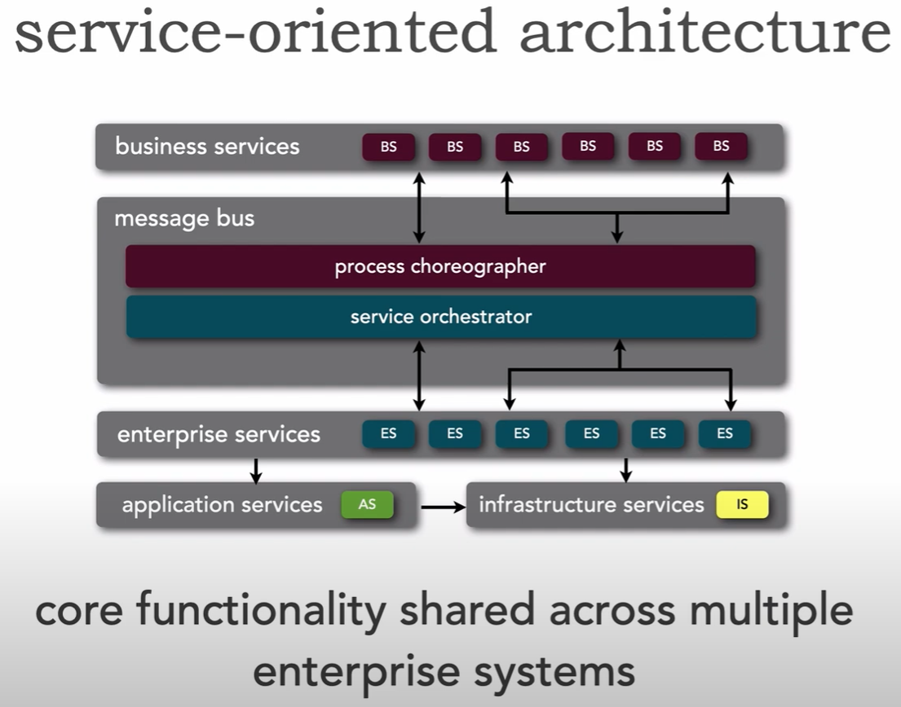

# Distribuované systémy

> Základní pojmy, principy. Rozdíl mezi centralizovanou a distribuovanou architekturou systému, nevýhody obojího a jejich překonávání. Replikace, sdílení dat. Architektura orientovaná na služby (SOA), webové služby. Příklady existujících technologií a jejich využití. Příklady z praxe pro vše výše uvedené. ([PA053](https://is.muni.cz/auth/el/fi/jaro2023/PA053/um/))

1. [Základní pojmy, principy (1/6)](#základní-pojmy-principy-16)
2. [Rozdíl mezi centralizovanou a distribuovanou architekturou systému, nevýhody obojího a jejich překonávání (2/6)](#rozdíl-mezi-centralizovanou-a-distribuovanou-architekturou-systému-nevýhody-obojího-a-jejich-překonávání-26)
3. [Replikace, sdílení dat (3/6)](#replikace-sdílení-dat-36)
4. [Architektura orientovaná na služby (SOA), webové služby (4/6)](#architektura-orientovaná-na-služby-soa-webové-služby-46)
5. [Příklady existujících technologií a jejich využití (5/6)](#příklady-existujících-technologií-a-jejich-využití-56)
6. [Příklady z praxe pro vše výše uvedené (6/6)](#příklady-z-praxe-pro-vše-výše-uvedené-66)

## Základní pojmy, principy (1/6)

**Distribuovaný systém** se skládá z komponentů (počítačů) propojených komunikační sítí. Distribuované systémy řeší problémy (výpočty/zpracovávání requestů) spoluprací jednotlivých komponentů (každý dělá něco). Díky tomu se systém snadněji škáluje (posilujeme subsystém, který má problémy).

### Typy architektur

Architektury popsány v [otázce 1](dev_1_programovani_a_softwarovy_vyvoj.md#vícevrstvá-architektura-moderních-informačních-systémů-architektura-model-view-controller-36), takže jen shrnutí:

#### Monolitická architektura
- obsahuje vše, co systém potřebuje, je možné pouze vertikální škálování, špatná spolehlivost (pád znamená pád celého systému)

#### Úrovňová (tiered) architektura
- nezaměňovat s layered
- jednotlivé úrovně lze distribuovat, paralelizovat, nahradit (komunikace skrz API)
- Klient může být tenký/tlustý dle poskytnuté funkcionality.
- př. Client → Server → Database

#### Hexagonal/Microkernel/component-based
- základní aplikace poskytuje minimální funkcionalitu, zbytek se dodává skrz plug-in komponenty komunikující přes předdefinované api
- komponenty je možné případně zapojovat za běhu systému
- další možnost využití komponentů - pokud potřebujeme používat legacy systém, který si nemůžeme dovolit přepsat, je možné ho zabalit jako komponent a přistupovat k němu přes naše kompatibilní rozhraní
- vývoj komponentových systémů je náročnější (zvlášť problematické je správně určit rozhraní), ale umožňuje větší přizpůsobitelnost/znovupoužitelnost komponentů v budoucích projektech
- např. extensions ve VSCode, component-based architekturu používá Jakarta Enterprise Edition, kde jednotlivé Java Beans jsou komponenty

#### Pipeline architecture
- sekvenční zpracování, každý komponent se stará o relativně transformaci vstupu na výstup (dělej malou věc, ale dělej ji dobře)

#### Service-oriented architecture
- popsáno v [samostatné kapitole](#architektura-orientovaná-na-služby-soa-webové-služby-46)

#### Microservice architecture
- vysoká koheze, nízká provázanost služeb, systém je tvořen velkým množstvím malých služeb
- důležitá je rychlá komunikace mezi službami (gRPC)
- služby nesdílí DB

### Komunikační paradigmata

#### Remote Procedure Call (RPC)
Umožňuje spuštění předem vystavené procedury mezi procesy (i na vzdáleném stroji) tak, jako bychom proceduru volali přímo v kódu. Implementace procedury může být v odlišném programovacím jazyce. Součástí je definice rozhraní, ze kterého je možné vygenerovat odpovídající volatelné funkce/struktury použité pro argumenty pro náš jazyk.

- De-facto standardem je dnes **gRPC**
- Pro fullstack typescript aplikace je dnes populární používat **tRPC**
- V PA053 se probírala **CORBA** (primární focus na Javu, ale podporovala i jiné jazyky, nejde jen o RPC, ale o architekturu pro komunikaci mezi objekty v distribuovaném prostředí), ale ta se v nových systémech prakticky nepoužívá kvůli složitosti/lepším alternativám, nahrazena jednodušším SOAP a REST, nebo RPC řešeními (gRPC, funguje na HTTP/2, zprávy binárně serializuje pomocí protocol bufferu).

#### Message Queues a Event Brokers
Pro komunikaci se v distribuovaných systémech kromě RPC používají **message queues** a **event brokers**, kteří umožňují komunikaci typu publisher-subscriber, nebo zpracování jedním z množiny příjemců, a jsou schopny zprávy persistentně uchovávat (hodí se pro transakční zpracování, spolehlivost v případě výpadku).

##### Message Queue (MQ)
Klasická FIFO fronta – každá zpráva má jednoho příjemce. Po přečtení je zpráva odstraněna z fronty. Konzument neví, kdo zprávu poslal a odesílatel neví, kdo ji přijme. Pokud je fronta plná, dochází k odmítání/mazání starých zpráv (podle konfigurace). [RabbitMQ](https://www.youtube.com/watch?v=NQ3fZtyXji0), Amazon SQS,

##### Event Queue
Primární nástroj pro event-driven architekturu. Publish-subscribe. Append-only log (zprávy se nemažou ihned po přečtení). Nově připojená služba může číst kompletní historii zpráv a rekonstruovat stav systému. Zprávy jsou časově seřazené. Použití: Event sourcing, stream processing, audity. [Apache Kafka](https://www.youtube.com/watch?v=uvb00oaa3k8), AWS Kinesis,

##### Message Bus (Event Broker / Pub-Sub Bus)
Rozesílá zprávu více příjemcům. Publish-subscribe (1:N). Každá zpráva je doručena všem odběratelům daného tématu. Pracuje s topics, na které se jednotlivé služby „přihlašují“ (subscribe). Odesílatel neřeší, kolik příjemců zprávu dostane. Použití: Reakce více subsystémů na stejnou událost, např. notifikace, cache invalidace. Kafka, Redis Pub/Sub, MQTT brokers

#### Alternativní komunikační způsoby
Alternativně se může pro komunikaci v distribuovaném systému používat např. REST, nebo (pokud chceme low level kontrolu a výkon) přímá komunikace mezi sockety.

### Cloudové a distribuované výpočetní paradigmata

#### Cloud Computing
**Cloud** - výhodou je, že můžeme používat platformu/infrastrukturu jako službu, aniž bychom se o ni museli starat/provádět nákladnou iniciální investici. Výpočetní výkon lze (i automaticky) upravit/škálovat na základě aktuálního vytížení. Fyzické zdroje mohou být sdílené, čímž je možné dosáhnout nižší ceny a je možné distribuovat výpočetní požadavky (peaky různých aplikací v různých dobách zvládne i jeden stroj). Datová centra lze volit na základě blízkosti k našim zákazníkům.

#### GRID Computing
**GRID computing** - výpočet velmi náročných úloh pomocí velkého množství zdrojů (např. dobrovolnický Folding@home). Zdroj může být CPU, storage, speciální zařízení, ...

#### Batch vs Stream Processing


U batch processingu můžeme distribuovat pomocí jednotlivých jobs, řeší se plánování jobs (může stačit obyčejná fronta)

Stream např. Apache Kafka

#### MapReduce
**MapReduce** - k transformaci dat používáme operace MAP (transformace dat 1:1) a REDUCE (sumarizace dat N:1). MAPery lze triviálně paralelizovat (stejné i rozdílné operace), u REDUCErů je to trochu složitější, paralelizujeme rozdílné operace. Např. Apache Hadoop

## Rozdíl mezi centralizovanou a distribuovanou architekturou systému, nevýhody obojího a jejich překonávání (2/6)

Hlavním rozdílem je, že centralizovaná architektura shromažďuje data a logiku na jednom místě, distribuovaná architektura rozptyluje logiku do více samostatných komponentů (běžících třeba i na samostatných strojích), které spolu komunikují.

### Nevýhody centralizované architektury a jejich řešení

**Nevýhody centralizované architektury:**
- neumožňuje horizontální škálování => **řešení:** škálujeme vertikálně
- selhání části znamená selhání celku => **řešení:** redundance, záložní servery
- nízká flexibilita, vysoká provázanost => **řešení:** důraz na kvalitu kódu

### Nevýhody distribuované architektury a jejich řešení

**Nevýhody distribuované architektury:**
- komplexita celkového systému, náročnější správa
- vyžadují více/složitější komunikaci, složitější synchronizace, náchylnost na latenci => **řešení:** použití message queues, gRPC, eventual consistency

### ACID vs BASE paradigma

Oproti centralizované architektuře distribuované systémy:

- nebývají požadavky/transakce ACID, ale **BASE**:
  - **BAsically available** - nefunkčnost části nezpůsobí nefunkčnost celku, zbytek funguje i v případě nefunkční části systému. např. na netflixu nemusí fungovat služba hledání, ale vše ostatní běží v cajku. Na každý dotaz dostaneme nějakou odpověď.
  - **Soft state** - změny v systému mohou nastávat i když nepřichází žádné dotazy - systém takto propaguje data, aby dosáhl konzistence
  - **Eventually consistent** - data nemusí být konzistentní okamžitě po získání odpovědi na dotaz, ale až po nějaké chvíli

### Výhody distribuované architektury

- selhání (pád) části systému neznamená pád celku
- jsou flexibilnější na modifikace díky nízké provázanosti

## Replikace, sdílení dat (3/6)

V distribuovaných systémech se používá replikace dat z různých důvodů. U distribuovaných databází (Apache Cassandra) /filesystémů (Apache Hadoop) to může být z důvodu bezpečnosti/dostupnosti/prevence výpadku, obecně se tím ale v systémech snažíme zajistit rychlejší odezvy.

### Problém centrální databáze

Centrální databáze, ve které se sdílí data, se může stát limitujícím bodem -> použijeme buď distribuovanou databázi, která replikaci řeší interně, nebo více databází, které mohou být jednodušší (MongoDB), protože se distribucí dat vzdáváme ACID a fungujeme s BASE. Určitá replikace dat vzniká kešováním (Redis). U replikace je potřeba nějakým způsobem řešit invalidaci dat po změně (timeout, nebo CQRS).

### Content Delivery Networks (CDN)

Replikace je kýžená u content delivery network (CDN), kde se snažíme mít statické zdroje (web, obrázky) co nejblíže uživateli, aby se dosáhlo rychlého načítání.

### NoSQL databáze a distribuční strategie

NoSQL databáze mají obvykle mechanismy pro automatickou replikaci/distribuci dat mezi různými uzly:

#### Sharding
Je možné použít **sharding** (rozbijeme data, uzel se stará o svou doménu) pro distribuci dat

#### Master-Slave replikace
**Master-slave replikace** pro škálování (u aplikací s častým čtením) a prevenci výpadků (spadne master? jeden ze slaves je nový master) - master se při zápisu stará o aktualizaci dat na slaves. Zapisujeme jen na mastera a ten pak zpropaguje na slaves, kteri jsou jinak read only a jsou pak treba bliz uzivatelum.

### Systémy pro sdílení dat

Pro sdílení dat (událostí) je možné použít **Apache Kafka**, platformu pro streamování dat ukládaných do logů. Pro sdílení informací o službách distribuovaného systému se dá použít **Apache ZooKeeper**.

## Architektura orientovaná na služby (SOA), webové služby (4/6)

### Architektura orientovaná na služby (SOA)

Architektonický styl, který rozděluje systém na volně provázané, vzájemně nezávislé a samostatně nasaditelné služby, z nichž každá implementuje ucelenou obchodní funkci. Služby komunikují pomocí standardních rozhraní (SOAP, REST, zpráv přes middleware/ESB apod.) a lze je vyvíjet, nasazovat a škálovat nezávisle.

#### Charakteristiky SOA:
- důraz na znovupoužitelnost služeb napříč celou organizací
- používá ESB (Enterprise Service Bus) pro komunikaci mezi službami
- standardy jako SOAP, WSDL, UDDI pro definici a objevování služeb
- služby jsou obvykle hrubozrnné (coarse-grained)
- centralizovaná governance a správa služeb
- těžší infrastruktura, komplexnější implementace
- fajn pro velké enterprise organizace s potřebou sdílení služeb
  

### Webové služby

Komponenty umožňující komunikaci a interakci prostřednictvím standardizovaných protokolů a formátů. Jsou založeny na Service Oriented Architecture. Web services poskytují abstrakci funkcionalitě služby skrz webové API. Skrz definiční jazyk je formálně popsáno schéma/rozhraní dané služby a je možné generování klientského kódu pro různé programovací jazyky s cílem usnadnit použití webové služby. Schéma může být zároveň generováno přímo ze zdrojového kódu prostřednictvím anotací.

#### Historické technologie (SOAP/XML)

Dříve se používaly web services založené na:
- **SOAP** (simple object access protocol)
- **XML**
- definované pomocí **Web Service Description Language (WSDL)**

*SOAP Request:*
```xml
<?xml version='1.0' ?>
<soapenv:Envelope
    xmlns:soapenv="http://schemas.xmlsoap.org/soap/envelope/"
    xmlns:xsd="http://www.w3.org/2001/XMLSchema"
    xmlns:xsi="http://www.w3.org/2001/XMLSchema-instance">
    <soapenv:Body>
        <ns1:echo
            soapenv:encodingStyle="http://schemas.xmlsoap.org/soap/encoding/"
            xmlns:ns1="http://localhost:8484/services/EchoService">
            <in0 xsi:type="xsd:string">Hello World</in0>
        </ns1:echo>
    </soapenv:Body>
</soapenv:Envelope>
```

##### WSDL (Web Service Description Language)
- **W3C specification** pro popis webových služeb
- **Programmatically generated** from source code annotations
- **Programming language independent** way to specify service interfaces
- **Podobné CORBA IDL**

#### Moderní technologie

Aktuálně se pro tyto účely spíše používá:

##### REST + JSON
- **REST** (representational state transfer, není to protokol, ale architektonický styl pro definici rozhraní)
- **JSON** (byť je možné použít i jiné formáty)
- definované pomocí **OpenAPI Specification**

##### GraphQL
- **GraphQL** (a JSON) se svým **GraphQL Schema** a dotazovacím jazykem
- GraphQL používa jeden entrypoint (+1 playground) a umožňuje přesně specifikovat kýžená data (až na úroveň polí) a řešit tak problém s:
  - **overfetching** (1 dotaz obsahuje zbytečná data)
  - **underfetching** (v dotazu nemáme dostatek dat, takže děláme více různých dotazů)

#### Porovnání SOAP vs REST

*SOAP je nezávislý na transportu, REST využívá HTTP. REST je jednodušší, rychlejší a efektivnější. SOAP umožňuje jednu zprávu cílit více příjemcům, přechod zprávy přes prostředníky, kteří mohou zpracovávat hlavičku (tělo je určeno jen příjemci). SOAP umožňuje výměnu strukturovaných a typovaných XML dat, SOAP hlavička (nepovinná) může obsahovat metadata, QoS, bezpečnostní informace, SAML data, session identifikátor (a.k.a. cookie)..., SOAP obálka je root XML prvek zprávy, obsahuje namespace (určující verzi protokolu), styl kódování dat, SOAP tělo obsahuje samotný obsah zprávy. REST umožňuje provázanost (díky hyperlinkům) a je možné se pomocí něj dostat na úplně jinou stránku mimo náš systém.*

*REST se dívá na web jako na zdroje adresovatelné URL, které vrací reprezentaci dat (HTML, XML, PNG, JSON...). Příjem dat uvede klienta do stavu, který může být transformován přístupem na jiný zdroj. Je bezstavový, každá zpráva obsahuje vše, co je nutné pro její interpretaci (správně by zpráva neměla obsahovat cookie, ale třeba JWT), dotazy jsou kešovatelné.*

## Příklady existujících technologií a jejich využití (5/6)

### Komunikační technologie

#### RPC frameworky
- **gRPC** - Google's high-performance RPC framework, používá HTTP/2 a Protocol Buffers
- **tRPC** - TypeScript-first RPC framework pro fullstack aplikace

#### Message Brokers
- **Apache Kafka** - distribuovaná streamovací platforma, high-throughput pub/sub messaging
- **RabbitMQ** - message broker s podporou různých messaging patterns
- **Redis Pub/Sub** - jednoduchý publish/subscribe messaging

### Databázové technologie

#### Distribuované NoSQL databáze
- **MongoDB** - document-oriented databáze s automatickým shardingem
- **Amazon DynamoDB** - fully managed NoSQL databáze
- **Apache HBase** - column-oriented databáze postavená na Hadoop

#### In-memory databáze a cache
- **Redis** - in-memory data structure store, používaný jako cache, message broker

### Big Data a Stream Processing

#### Batch Processing
- **Apache Hadoop** - framework pro distribuované ukládání a zpracování big data
- **Apache Spark** - unified analytics engine pro large-scale data processing

#### Stream Processing
- **Apache Kafka Streams** - stream processing library
- **Apache Storm** - real-time computation system

## Příklady z praxe pro vše výše uvedené (6/6)

#### Netflix
- **Architektura:** Microservices (600+ služeb)
- **Databáze:** Cassandra pro user data, MySQL pro billing
- **Komunikace:** REST APIs, event-driven architecture
- **CDN:** Vlastní CDN pro video streaming
- **Resilience:** Circuit breakers, bulkheads, timeouts

#### Spotify
- **Event-driven:** Kafka pro user activity tracking
- **Recommendation engine:** Apache Spark pro ML workloads
- **Content delivery:** Multi-CDN strategy
- **Service mesh:** Envoy proxy mezi services

### Event Sourcing a CQRS

#### Event Store
```json
{
  "eventId": "uuid",
  "eventType": "UserRegistered",
  "aggregateId": "user-123",
  "data": {
    "email": "user@example.com",
    "timestamp": "2023-01-01T00:00:00Z"
  }
}
```
### Middleware v praxi

**Middleware** - vrstva softwaru poskytující rozhraní pro interakci s různými službami/systémy, abstrakce k často používané funkcionalitě, případně vrstva propojující existující systémy.

Příklady middleware:
- **CORBA, Web Services, REST** - komunikační middleware
- **Message queue systémy, event brokeři** - messaging middleware
- **Apache Camel** - integration framework
- **Spring Boot** - application framework s middleware capabilities

[Go to the next question](./dev_1_programovani_a_softwarovy_vyvoj.md)
