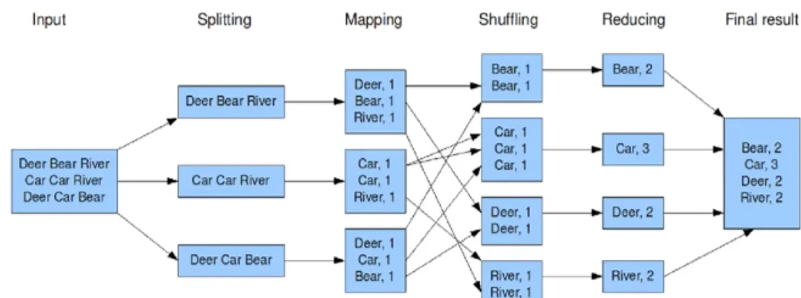

# Zpracování dat

> Základní pojmy a principy datových skladů, datové analytiky a business intelligence. Životní cyklus datového skladu. Analytika velkých dat, jazyky pro realizaci analytický úloh, analytika na úrovni databází. Pokročilé techniky zpracování dat, výkonnostní aspekty zpracování velkých dat. Příklady z praxe pro vše výše uvedené. (PA036, PA220 || PA212)

1. [Základní pojmy a principy datových skladů, datové analytiky a business intelligence (1/5)](#základní-pojmy-a-principy-datových-skladů-datové-analytiky-a-business-intelligence-15)
2. [Životní cyklus datového skladu (2/5)](#životní-cyklus-datového-skladu-25)
3. [Analytika velkých dat, jazyky pro realizaci analytických úloh, analytika na úrovni databází (3/5)](#analytika-velkých-dat-jazyky-pro-realizaci-analytických-úloh-analytika-na-úrovni-databází-35)
4. [Pokročilé techniky zpracování dat, výkonnostní aspekty zpracování velkých dat (4/5)](#pokročilé-techniky-zpracování-dat-výkonnostní-aspekty-zpracování-velkých-dat-45)

## Základní pojmy a principy datových skladů, datové analytiky a business intelligence (1/5)

### Business intelligence

- procesy a nástroje pro sběr, analýzu a prezentaci/vizualizaci dat za účelem asistence při tvorbě informovaných rozhodnutí v podnikovém řízení
- umožňuje transformaci dat do informací
- jádrem je **datový sklad**

### OLTP (online transaction processing)
- způsob ukládání dat v db pro transakční zpracování
- data v databázi se mění, cílem je zajistit konzistenci a umožnit CRUD
- nutné zamykání tabulek/řádků pro zajištění konzistence
- vhodné pro uložení dat v operativním provozu podniku (zajímá nás, co máme na skladě, jaká je aktuální cena produktů...)
- normalizovaná forma (není datová redundance, používají se public keys pro případné spojování dat)
- používané queries známe dopředu

### OLAP (online analytical processing)
- způsob ukládání dat pro analytické zpracování
- data v databázi se nemění
- zamykání není třeba, data se nemodifikují
- pracujeme s mnohem větším objemem dat
- vhodné pro dlouhodobé uložení dat, reflektuje historii dat z produkční databáze a jejich vývoj v čase
- denormalizovaná forma, hodně indexů, snažíme se minimalizovat nutné joiny, nevadí datová redundance
- **hvězdicové schéma/dimenzionální modelování** - středobodem je vždy nějaký subjekt (obsahující fakta např. prodej) s **tabulkou faktů** (obsahující konkrétní záznamy měření), ke které se pomocí referencí (foreign key) vážou **tabulky dimenzí** (často odpovědi na otázky KDO, KDY, KDE, JAK..., obvykle detailní (denormalizované) pro snadnou analytiku, redundance nevadí, např. datum dělíme na den, měsíc, rok, den v týdnu, kvartál... můžeme mít separé date i time dimenze, obvykle 4-15). Čím více dimenzí máme, tím více/konkrétněji se můžeme DW dotazovat (dimenze tvoří kontext). Tabulky dimenzí obvykle předvyplníme (pro datum můžeme použít numerický přepis data, např. 20230621), rozlišujeme dimenze data a času. Jako stěžejní data (to, co nás zajímá) bereme fakta, dimenze jsou popisná data k faktům, podle kterých je možné seskupovat. Reference jsou jen v tabulce faktů. ID pro tabulky (surrogate keys, int) dimenzí si generujeme sami, abychom nebyli limitováni použitými klíči z OLTP.
  
- typy faktů:
    - **transakční** - událost spojená s hodnotou (např. nákup)
    - **snapshot** - zachycující nějakou aktuální hodnotu (např. naplněnost skladu)
    - **bez hodnoty** - fakt nemá žádnou numerickou hodnotu, obvykle jde o nějakou událost (např. click na určitý prvek)
      Za fakty se považují i odvozená data (např. kumulativní hodnoty za nějaké období), nebo data kombinovaná z více procesů (např. prodeje a jejich předpovědi pro dané období). Ty obvykle neukládáme do tabulky faktů (ale může to mít své opodstatnění, třeba pro zrychlení dotazů)
- nevadí nám drobná neaktuálnost dat
- query neznáme dopředu, záleží na tom, co chceme zjistit
  

**Snowflake schema** - star schema, kde dimenze mají hloubku (obsahují reference na další tabulky, např. obsahující month ID a month name). Způsobují performance problémy, jde o antipattern.

**Granularita** popisuje, z jaké úrovně se na fakta díváme (např. zajímá nás, kolik se prodalo daného produktu? Za jeden den? V konkrétním obchodě?). Nejnižší granularita je jeden fakt (ukládáme opravdu fakty, nebo třeba jen agregovaná data?).

**Měření/Measure** - aspekt faktu, který nás zajímá, lze agregovat (např. cena prodeje). Některé hodnoty měření lze sčítat (např. tržby), některé jen v některých dimenzích (např. zůstatek na pokladnách, nelze sčítat v čase), některé vůbec (např. cena za jednotku produktu nebo průměrná cena za období...)

**Conformed (přizpůsobivá?) dimension** - dimenze, která má stejné hodnoty a význam pro data pocházející z více zdrojů. Např. čas je obvykle conformed dimenze, pobočka nemusí být (pod jakou pobočku by spadal prodej přes internet?).

### Datový sklad

- OLAP
- oddělení od OLTP, abychom nezatěžovali produkční db
- obvykle 1 db fungující jako centrální zdroj pravdy pro analýzu a reporting
- data ve skladu se nemění, pouze přidávají, je vidět vývoj dat v čase
- může obsahovat data z více zdrojů
- vyžaduje, aby byla zdrojová data očištěna a konzistentně uložena
- lze využít standardní databázi (např. postgres), nebo specializovaná řešení (např. Google BigQuery, Teradata)
- jednoduchá reprezentace dat, aby s nimi mohli pracovat analytici a bylo umožněno používat jednoduché analytické dotazy (s minimem joinů)
- cílem je umožnit a zjednodušit analýzu dat

### Data mart

- malý data warehouse, soustředí se na jednu zájmovou jednotku (např. objednávky)
- cílem je dekompozice za účelem zvýšení efektivity/omezení přístupu do jednotlivých částí datového skladu
- mohou být dvě podoby:
    - **Nezávislé data marty** - nemáme žádný centrální zdroj pravdy (DW), data do data martů jdou přímo ze zdrojů
    - **Logické data marty** - data marty fungují jako logické pohledy na část datového skladu, jednodušší na údržbu

### Data Cube

- obsah DW, umožňuje pohled na data z různých dimenzí (rozměrů kostky, obvykle 4-15)
- skládá se z buněk (cells) - každá je kombinací hodnot dimenzí. No data = prázdná buňka.
- **Dense/sparse cube** - hodně/málo neprázdných buněk v data cube

Na datový sklad/data marty jsou obvykle napojeny další **vizualizační aplikace** (např. Grafana, Kibana, PowerBI, nebo třeba R project)

## Životní cyklus datového skladu (2/5)

Životní cyklus:

- **Určení cíle a plánování** - co od systému očekáváme, jaký rozsah dat nás zajímá, odhad ceny, rizik, prioritizace subjektů (=> datamartů)
- **Návrh infrastruktury** - volba vhodných nástrojů a technologií, architektonických řešení
- **Návrh a vývoj data martů** - iterativně tvoříme data marty, každý zapojujeme do DW systému
    - **volba procesu** - včetně modelování procesu (třeba UML diagramem, nebo BPMN), např. prodeje
    - **určení granularity** - např. prodej jednoho produktu (jedné položky z objednávky) jednomu zákazníkovi, na jedné pobočce v jeden moment
    - **identifikace dimenzí** - vychází z granularity, můžeme dimenze rozšířit o další jevy (např. den v týdnu, slevové akce...)
    - **identifikace faktů** - všech sloupců, které budou v tabulce faktů (např. cena jednotky produktu, prodané množství)
    - čištění dat a jejich přidání do DW systému
- **ETL (Extract, Transform, Load)** - v průběhu života do skladu přibývají data, které je vždy třeba:
    - **extrahovat** z datových zdrojů (např. produkční db)
    - **transformovat**
        - odstranit duplicity
        - upravit, aby odpovídala jednotnému stylu v DW, učesat do formátu používaném v DW
        - vyčistit od nekompletních dat/chyb (spelling errors)
        - občas může být třeba rozbít data na více sloupců (name => first name, last name)
        - lze částečně automatizovat, ale mnohdy jsou třeba manuální zásahy
        - obvykle nevkládáme přímo do dw, ale do staging table (může být csv ve formátu dw tabulek)
        - je fajn dělat po částech, ať se do toho nezamotáme
    - **naplnit** (load) do DW
        - nejprve aktualizujeme dimenze (abychom měli k dispozici foreign keys), pak fakta
        - upsert (update, insert if not exists) je často drahý -> je fajn detekovat neexistující, pak vložit nové, a pak updatovat
        - je fajn naplňovat po velkých částech (např. indexy/materializovaná views přepočítat až po vložení, ne po každém řádku, stejně tak integrity checks)
        - může pomoct, když vkládáme předřazená (presorted) data
        - paralelizace (jednotlivé dimenze, tabulky faktů i partitions tabulek faktů lze provádět souběžně)

### Změny dimenzí

Dimenze se mohou v průběhu života DW měnit (změní se třeba region, pod který spadá pobočka)

Možnosti implementace změny:
- **Přepis** - nahradíme stará data novými, je to jednoduché, ale ztrácíme informaci o historii
- **Přidání sloupce s předchozí verzí (a valid from)** - vyřeší problém, ale při další změně čelíme stejnému problému
- **Verzování** - tabulce dimenzí přidáme sloupce `valid from` a `valid to`, při změně pouze upravíme `valid to` a přidáme řádek pro novou hodnotu dimenze
- **Přidání dimenze** - výběr aktuální verze musíme řešit jen v případě, že nás daná hodnota zajímá (např. mění se přiřazení obchodu do regionu, ale ne v každém dotazu nás zajímá region)

Pokud často pracujeme s aktuální hodnotou, můžeme použít verzování, ale držet i aktuální hodnotu v separátním sloupci.

### Přístupy tvorby datových skladů

- **top-down** - analogie vodopádu, nejdříve analyzujeme datové zdroje, pak navrhneme a implementujeme sklad, nakonec naplníme daty a vytvoříme data marty
- **bottom-up** - iterativně-inkrementální přístup, postupně pro každý zájmový objekt analyzujeme zdroje, postavíme data mart a případně rozšíříme (pokud nějaký centrální používáme) datový sklad

## Analytika velkých dat, jazyky pro realizaci analytických úloh, analytika na úrovni databází (3/5)

### Big data

**Big data** - jedná se o data, které kvůli své rychlé a kontinuální tvorbě, velkému objemu, či složitosti, vylučují zpracování tradičními analytickými způsoby.

- Rychlý příchod dat vyžaduje kontinuální zpracování. Nepoužíváme batch processing, je potřeba stream processing (pro distribuované zpracování velkého množství zpráv/předání dat mezi systémy třeba Apache Kafka).
- Velikost dat lze zvládat pomocí distribuovaných databází/souborových systémů (obvykle NoSQL databáze, nebo Hadoop Distributed File System)
- pro zvládání složitosti dat (komplexní vztahy, či data typu video) je nutné použít specializované nástroje (pro vztahy třeba grafovou databázi).

### Přístupy ke zpracování dat

- **batch** - jednou za čas aktualizujeme náš DW, doplníme nově vzniklá data
- **stream** - průběžně vkládáme data tak, jak vznikají (důležité je udržovat konzistentní formát dat), snadněji se škáluje

### Jazyky pro realizaci analytických úloh

- Tradičně jde o SQL, nebo jeho deriváty, které datoví analytici dobře znají.
- Pro pokročilejší zpracování lze využít model MapReduce (a Hadoop), ve kterém je možné specifikovat transformační uzly v jakémkoliv programovacím jazyce
- NoSQL databáze mohou mít vlastní rozšíření sql, nebo úplně jiný přístup k analytickým dotazům (např. mongo má knihovny pro různé jazyky)

### Druhy sql dotazů specifické pro analytiku

- **Slice** - v rámci jedné dimenze vybíráme konkrétní hodnotu a zobrazujeme pouze data s touto hodnotou dimenze. V sql pomocí WHERE. Např. kolik se prodalo laptopů?
- **Dice** - jako slice, akorát pracujeme s intervaly/více hodnotami jedné dimenze (např. prodeje od-do, prodeje laptopů a telefonů), nebo hodnot více dimenzí (prodeje laptopů v říjnu)
- **Roll-up** - provádíme agregaci dat. Dimenzionální - můžeme vynechat nějakou dimenzi (kolik jsme prodali za celý čas? kolik ve všech pobočkách?) nebo hierarchický - můžeme se dívat z pohledu vyšší úrovně nějaké dimenze (kolik jsme prodali v jednotlivých regionech, které se skládají z více poboček?). Oba přístupy lze kombinovat. V sql pomocí agregačních funkcí (GROUP BY a třeba SUM)
- **Drill-down** - opak roll-upu, jdeme z abstrakce do většího detailu. Je nutné, aby nějaká detailnější data existovala. Obvykle děláme drill-down z nějakého materializovaného pohledu a jdeme na konkrétní data.

### Pivoting

- přeskládání a agregace dat za účelem vizualizace
- nejjednodušší variantou je **kontingenční tabulka** (cross table), ve které se zaměřujeme na dvě dimenze:
  
- v SQL se dříve muselo provádět pomocí sjednocení (union) několika příkazů
  
- nyní je v SQL možné použít (uvádím i příklady, je možné uvést více sloupců pro vícedimenzionální kontingenční tabulky):
    - `GROUP BY ROLLUP(year, band)` - vrací *polovinu* kontingenční tabulky (vrátí data, agregaci pro každý rok a celkovou agregaci)
      
    - `GROUP BY CUBE(year, band)` - vrací celou kontingenční tabulku (vrátí data, agregaci pro každý rok, agregaci pro každou skupinu a celkovou agregaci)
      
    - `GROUP BY GROUPING SETS(...)` - umožňuje větší kontrolu nad agregací dat (lze mimo jiné realizovat příkazy ROLLUP, CUBE)
      

### Přístupy k implementaci OLAP

- **Relational OLAP (ROLAP)**
    - data ukládáme v relační databázi (např. postgres), dimenze simulujeme pomocí star schema, pro dotazování používáme standardní SQL
    - (+) není potřeba specializovaný systém
    - (+) dobrá flexibilita
    - (-) response time
    - (-) zabírá 3-4x více místa, než MOLAP (v případě dense cubes)
- **Multidimensional OLAP (MOLAP)**
    - data ukládáme ve speciálních multidimenzionálních strukturách (např. in-memory db, nebo multidimenzionální pole/matice kde používáme přímou adresaci na disku)
    - rychlejší queries než ROLAP, zabírá míň místa (není potřeba ukládat foreign keys)
    - horší flexibilita (při přidání hodnoty do domény dimenze je nutné přidat velké množství buněk, u ROLAP jde o jeden řádek v tabulce dimenze)
    - je potřeba specializovaný systém
    - mnohdy bývá součástí/add-on databázového řešení (MS SQL Server, Oracle...)
- **Hybrid OLAP (HOLAP)**
    - kombinace MOLAP a ROLAP
    - čistá data uložena v ROLAP
    - agregace uloženy v MOLAP
    - => flexibilita, rychlost, ale vyšší složitost systému

## Pokročilé techniky zpracování dat, výkonnostní aspekty zpracování velkých dat (4/5)

Pro zajištění rychlosti dotazů v OLAP se používá redundance v podobě:

- materializovaných pohledů (vkládáme jednou za čas, takže to není problém)
- indexů
- denormalizovaného schématu

### Indexy

**Indexy** - umožňují rychlejší získání dat, která nás zajímají, pomocí předpočítaných výsledků. Omezují prostor nutný k prohledání při čtení dat.

- obvykle se používají [B+ stromy](4_databaze.md#indexování), ty jsou však limitovány jen pro 1D data, nejsou vhodné pro více dimenzí
- **UB stromy** - multidimenzionální data jsou linearizovány pomocí Z-křivky a následně indexovány pomocí B* stromu (jako B+, akorát tam jsou jiná pravidla pro rebalanc). Linearizace Z-křivkou poskytuje dobrý výkon pro intervalové dotazy a zajišťuje, že data, která si byla blízká původně si budou blízká i po linearizaci. Indexovat do linearizovaných dat lze pomocí konverze souřadnic na binární číslo a následném prokládání bitů souřadnic.
  |||
  |---|---|
  |||
- **R stromy** - obdélníky, popsány v [otázce 5](4_databaze.md#indexování), špatně se škálují do mnoha dimenzí
- **Bitmap indexy** - vhodné pro dimenze s málo variantami (např. pobočky). Pro každou variantu uděláme bitové pole o délce tabulky faktů. Index v poli odpovídá řádku v tabulce faktů. U pole nastavíme 1 pro indexy, ve kterých varianta platí, jinak 0. Výhodou je, že se snadno používají bitové operace (AND, OR) a je možné takto pracovat i s rozdílnými dimenzemi. Při mazání v tabulce faktů je třeba buď upravit všechny bitmap indexy, nebo v tabulce faktů použít *tombstone* hodnotu (považujeme za prázdnou).
- **Range-encoded bitmap indexy** - vyžadují, aby měla dimenze seřazené hodnoty variant (jinak stejně nemá cenu hledat pomocí intervalů). Opět má každá varianta bitové pole délky tabulky faktů. Pokud je varianta pro daný fakt pravdivá, nastavíme ji, a všechny následující varianty v pořadí, na hodnotu 1 (jinak 0). (Hodnota neznamená např. *narodil se v měsíci*, ale *byl už na živu v měsíci*) Při intervalovém dotazu pak stačí provést `<lower> AND (NOT <upper-exclusive>)`.
  

### Partitioning

**Partitioning** - dělení dat (tabulky) na více (nepřekrývajících se) částí

- přístupy:
    - logické - dělíme dle data/organizační jednotky/kategorie... nebo kombinace těchto faktorů
    - fyzické - distribuce dat na různé výpočetní uzly, umožnění paralelního zpracování na více strojích
- může být implementováno přímo v databázovém systému, nebo si ho zajistíme na aplikační úrovni (náročnější)
- typy dělení:
    - horizontální - tabulku dělíme na více tabulek se stejnými sloupci, obvykle podle intervalu (často časová dimenze, případně nějaká, co se často nemění), ale je možné i třeba podle hashe
    - vertikální - část sloupců přesuneme do jiné tabulky (a.k.a. row splitting, vztah 1:1), dává smysl když určité sloupce nepoužíváme často.
- data používaná společně by měla být uložena společně
- fajn pro škálování, části lze nezávisle prohledávat na více strojích
- nevýhodou je vyšší složitost systému, při vertikálním dělení jsou drahé joiny
- doporučuje se dělat partitioning, když má tabulka >100 milionů řádků/je větší než 2GB

### Optimalizace JOINů

JOINy jsou:
- komutativní (nezáleží na pořadí operandů, `A JOIN B = B JOIN A`)
- asociativní (nezáleží na závorkách, když chceme použít víc operandů, `(A JOIN B) JOIN C = A JOIN (B JOIN C)`)
  => pořadí JOINů lze přeskládat, abychom získali rychlejší provedení SQL dotazu

- obvykle optimalizace provádí databázový systém:
    - počet kombinací pořadí joinů je `n!` -> pro jednoduché queries je možné zkoumat všechny možnosti, u složitějších je nutné použít metaheuristiky (např. genetické algoritmy)
    - uživatel může poskytnout hinty/vnutit vlastní plán (pokud víme, co děláme, můžeme být snadno lepší)
- pokud jsou dimenze dost restriktivní (filtrují hodně faktů), může být vhodné udělat cross join dimenzí

### Pohledy

- klasický pohled (**view**) připomíná funkce v programovacích jazycích - pojmenovaný dotaz. Při dotazu nad view se automaticky provede selekce dat
- **materializovaný pohled** funguje jako klasický pohled, ale má předpočítaný výsledek, uložený v tabulce (funguje jako cache), takže dotazy na materializovaný pohled jsou rychlejší. Při změně underlying dat se musí data materializovaného pohledu přepočítat/rozšířit (lze odložit, ale pak máme nekonzistenci), což u OLAP není zas takový problém, jako u OLTP.
    - vhodné pro často používané a drahé dotazy/části dotazů

### Databázové technologie pro Big Data

**Sloupcové databáze** - na rozdíl od řádkových databází (např. Postgres), kde jsou uloženy vedle sebe data náležící jednomu řádku ukládají sloupcové databáze (např. BigQuery, S4HANA) vedle sebe data z jednoho sloupce. Díky tomu mohou být sloupcové databáze rychlejší pro čtení dat.

**In-memory databáze** - namísto uložení dat na pevném disku držíme data v RAM -> rychlejší přístup, ale mnohem vyšší cena. Např. S4HANA

**Distribuované databáze** - umožňují horizontální škálování, svou distribuovaností umožňují fault-tolerance (díky replikaci dat), např. Hadoop Distributed File System, Apache Cassandra.

### NoSQL (not only sql)

- **key-value stores** - data ukládáme/hledáme pomocí klíče, snadno se používají jako cache např. Redis
- **dokumentové databáze** - data ukládají ve formě dokumentů (každý má klíč, podle kterého se referencuje, jinak je to klasická struktura/třída) a kolekcí dokumentů, např. Mongo, Firebase
- **sloupcové databáze** (column family, wide-column) - data jsou organizována do tzv. "rodin sloupců" (column families), které mají společné vlastnosti nebo jsou často používány společně, např. Cassandra
- **grafové databáze** - snadno modelují entity a vztahy, např. Neo4j
- obvykle nebývají ACID (a nepoužívají joiny), díky čemuž mohou být rychlejší. Větším problémem je udržení konzistence dat. Některé poskytují distribuci dat na více výpočetních uzlů out of the box (co vím tak mongo, cassandra)

### Apache Hadoop

**Platforma pro paralelní/distribuované zpracování velkých datasetů**

- batch processing
- vysoká dostupnost zajištěna replikací dat
- využívá **Hadoop Distributed File System (HDFS)**
    - distribuovaný souborový systém vhodný pro immutable data
    - abstrahuje distribuovanost, uživatel pracuje s daty jednotným způsobem
    - high availability díky replikaci, data rozdělena do bloků (defaultně 128MB), každý je v HDFS replikován (defaultně 3x, každá replikace na jiném stroji)
    - jeden stroj je **name node** (master), ostatní **data nodes**. Master má přehled o mapování souborů na bloky a jejich lokaci na data nodes (tato data jsou taky replikována). Pro získání dotazu klient kontaktuje mastera (zjistí, kde má hledat data) a následně kontaktuje příslušné data nodes.
    - datové bloky jsou write-once (díky čemuž nemusíme řešit zamykání a dosahujeme vyšších rychlostí čtení)
- spolu s HDFS využívá modelu **MapReduce**
    - umožňuje paralelní zpracování dat
    - uživatel definuje jen použité map a reduce funkce (může jich být více)
    - postupně probíhá Map, Grouping a Reduce fáze
    - **Map** - transformace dat (filtrování, sorting). Bere vždy jednu položku dat (např. řádek) a vrací 0-1 key-value pár. Tímto způsobem zpracuje všechna data
    - **Grouping** fáze - děje se automaticky po map fázi, seskupuje data se stejným klíčem (vznikne key-list) a předá data se stejným klíčem jednomu reduceru
    - **Reduce** - agregace dat podle klíče, sumarizace výsledků Map operací. Bere key-list (obsahující všechny hodnoty pro daný klíč) a vrací key-list (obsahující 0-n výstupních záznamů).
      Např. word count - map bere řádek a vrací několik (dle výskytu na řádku) dvojic `(slovo, 1)`. Reduce sečte `1` pro daná slova a vrací `(slovo, součet)`.
      

### Apache Hive

- distribuovaný data warehouse postavený nad Hadoop (a HDFS)
- poskytuje SQL-like (HiveQL) rozhraní pro dotazy, které je převedeno do MapReduce dotazů (je možné dělat i vlastní map reduce skripty)
- umožňuje používání strukturovaných dat (struktury, seznamy, mapy)
- umožňuje serializaci/deserializaci dat do/z různých formátů (xml, csv, json...)
- vhodný pro dlouho běžící ETL jobs
- pokud chceme low latency/interactive queries, je vhodnější použít Apache Impala (SQL query engine nad Hadoopem)

### Stream processing

- nezpracováváme balík dat, ale kontinuální stream
- Apache Spark (analytický engine pro large-scale data processing, umí batch i stream processing)
- Apache Storm (real-time výpočty, skládá se ze zdrojů dat a acyklicky propojených zpracovávajících uzlů)

## Notes

### Příklad architektury Data Warehouse pro Big Data

